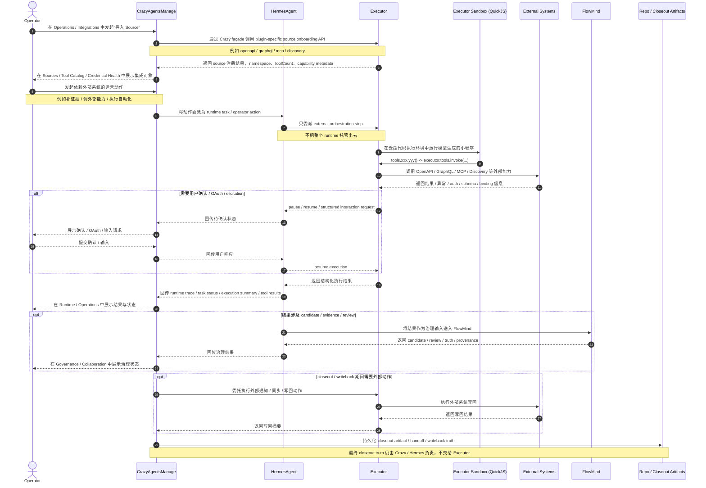
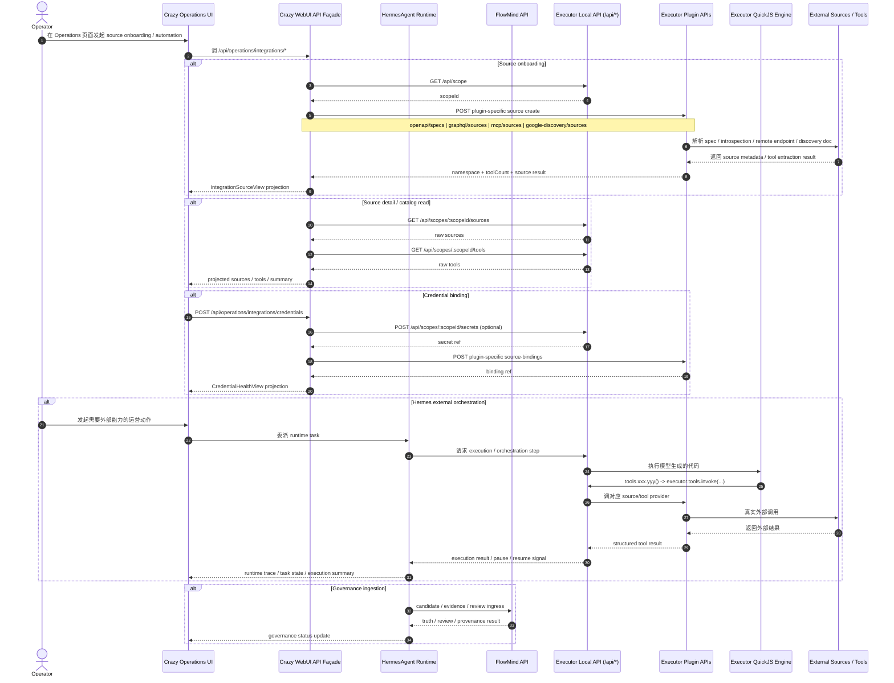
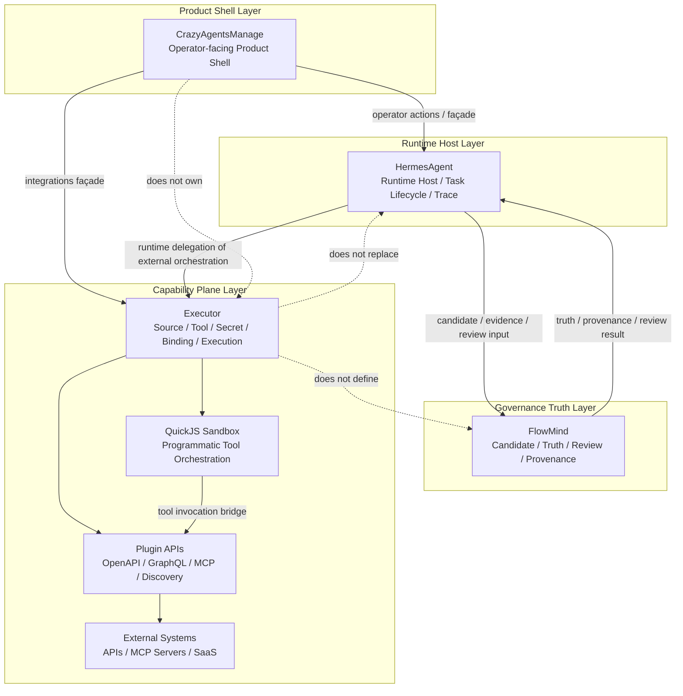

# Crazy / Hermes / FlowMind / Executor 嵌入分析

## 文档目的

本文档总结以下四个系统之间的关系，并分析 `Executor` 在当前产品体系中的合理嵌入场景与机制：

- `CrazyAgentsManage`
- `HermesAgent`
- `FlowMind`
- `Executor`

同时给出一张文字版时序图，说明四者在典型集成任务中的协同方式。

---

# 1. 四者的职责边界

## 1.1 HermesAgent

HermesAgent 是：

- 运行时宿主
- 运营执行面
- session / trace / token / tool 调用现场的持有者
- 任务执行与协作分发入口

它回答的是：

- 当前有哪些任务在运行
- 哪些任务卡住了
- 哪些工具被调用了
- 当前运行代价和状态如何

HermesAgent 负责 **runtime truth**。

---

## 1.2 FlowMind

FlowMind 是：

- 治理引擎
- canonical truth 层
- candidate / review / truth / provenance 的持有者

它回答的是：

- 什么还只是 candidate
- 什么已经成为 truth
- 什么需要 review
- 什么出现 drift / blocked

FlowMind 负责 **governance truth**。

---

## 1.3 CrazyAgentsManage

CrazyAgentsManage 是：

- operator-facing product shell
- 把 Hermes 的运行态、FlowMind 的治理闭环、外部能力平面组织成产品交互系统
- 一级 IA 的拥有者：
  - Overview
  - Runtime
  - Operations
  - Governance
  - Collaboration

它回答的是：

- operator 看到什么
- operator 在哪里操作
- 哪些对象是运营对象
- 哪些治理/协作结果需要沉淀成产品表面

Crazy 负责 **product shell / operator façade**。

---

## 1.4 Executor

Executor 是：

- AI execution + integration platform
- source / tool / secret / plugin / execution 的能力底座
- OpenAPI / GraphQL / MCP / Discovery / secret provider / sandbox execution 的统一承载层

它回答的是：

- 外部 source 怎么接入
- tool catalog 怎么生成
- secrets / connection / binding 怎么管理
- 代码驱动的工具编排如何执行

Executor 负责 **capability substrate**，而不负责 Crazy 的主产品模型。

---

# 2. 核心判断

## 2.1 Executor 的合理位置

在 Crazy / Hermes / FlowMind 三者联动关系下，Executor 最合理的嵌入位置不是“主干底座”，而是：

> **Hermes / Crazy 侧的外部能力执行平面（external capability plane）**

也就是：

- Crazy 保持产品壳
- Hermes 保持 runtime truth
- FlowMind 保持 governance truth
- Executor 提供：
  - integrations
  - source onboarding
  - tool catalog
  - secret / credential binding
  - external code-driven orchestration

---

## 2.2 为什么不能让 Executor 接管主模型

如果让 Executor 直接接管 Crazy 或 Hermes / FlowMind 的主对象，会产生三类问题：

### A. Runtime truth 混淆
Executor 的 execution state 不能替代 Hermes 的 session / trace / token telemetry。

### B. Governance truth 混淆
Executor 能拿到外部结果，但不能判定 candidate 是否成为 truth。

### C. Collaboration truth 混淆
Executor 可以执行写回动作，但不能拥有 closeout / repo writeback / handoff artifact 的最终语义。

所以 Executor 只能嵌在能力层，不能吞掉产品层、运行层、治理层、协作层。

---

# 3. Executor 的嵌入场景

## 场景 A：Operations / Integrations 控制台

这是当前最自然、最稳定的嵌入点。

### 触发方
- Crazy operator
- Crazy `Operations` 页面

### Executor 承担
- source onboarding
- tool catalog list
- provider / secret / binding 管理
- capability health 暴露

### Crazy 承担
- 统一 IA
- 列表 / detail / rail UI
- operator-facing 术语投影

### 好处
- 不重造 source / tool / secret / plugin substrate
- 产品语言仍然由 Crazy 控制
- UI 不直接暴露 executor 内部术语

---

## 场景 B：Hermes 发起的外部能力编排

这是 Executor 的第二个高价值嵌入点。

### 触发方
- HermesAgent runtime task
- 或 Crazy 中 operator 发起的动作，最终委派给 Hermes

### Executor 承担
- 让模型写一段受控代码
- 在 QuickJS 沙箱中执行
- 代码里通过 `tools.xxx.yyy()` 访问真实 source/tool
- 支持 pause / resume / elicitation

### Hermes 承担
- 任务生命周期
- runtime trace
- tool 调用现场记录

### FlowMind 承担
- 把结果作为 candidate / evidence 接入治理

### 典型任务
- 批量抓取外部 API 数据
- 跨 OpenAPI / GraphQL / MCP 组合调用
- 条件判断 + 循环 + 汇总
- operator automation

### 好处
- 把工具使用从“逐轮函数调用”升级为“程序式工具编排”
- 降低模型回合数
- 中间状态落在代码变量里，而不是落在对话记忆里

---

## 场景 C：FlowMind 治理前的证据扩充

### 触发方
- FlowMind review 流程需要补证据
- Hermes / Crazy 执行外部补证据动作

### Executor 承担
- 拉取外部事实
- 做 cross-system query
- 汇总候选证据

### FlowMind 承担
- 审核这些证据是否足以支撑 truth

### 好处
- FlowMind 不需要自己集成所有外部系统
- executor 负责“拿到能力结果”
- FlowMind 负责“判断结果是否构成真相”

---

## 场景 D：Collaboration / Closeout 期间的外部写回

### 触发方
- Crazy collaboration 流程
- Hermes closeout 流程

### Executor 承担
- 调外部系统
- 发通知
- 同步外部记录
- 执行受控写回动作

### Crazy / Hermes 承担
- closeout artifact
- handoff package
- repo writeback 事实层

### 好处
- 外部动作执行与产品语义分离
- closeout 真相仍属于 Crazy / Hermes
- executor 只是动作执行器

---

# 4. Executor 的嵌入机制

## 机制 1：Crazy façade → Executor API

推荐链路：

```text
Crazy UI
  -> Crazy Operations façade API
    -> Executor local/cloud API
```

而不是：

```text
UI -> Executor raw API everywhere
```

### 原因
- 保持 Crazy 的产品术语
- 允许字段投影
- 保留未来替换 executor 的余地
- 避免 UI 对 executor 内部对象结构强耦合

---

## 机制 2：Hermes 调 Executor execution engine，而不是被 Executor 托管

推荐链路：

```text
Hermes runtime task
  -> delegate external orchestration step to Executor engine
  -> Executor sandbox code + tool orchestration
  -> Hermes records runtime trace
  -> Crazy renders
  -> FlowMind consumes result if needed
```

而不是：

```text
Hermes runtime session = Executor execution session
```

### 原因
- Hermes 仍保有 runtime truth
- Executor 只负责 external capability execution
- 不污染 Hermes 的运行时主模型

---

## 机制 3：Source onboarding 按插件类型分流

Executor 在真实 HTTP 模式下并没有一个万能的“创建任意 source”的统一 endpoint。

真实写入是 plugin-specific：

- OpenAPI → `/api/scopes/:scopeId/openapi/specs`
- GraphQL → `/api/scopes/:scopeId/graphql/sources`
- MCP → `/api/scopes/:scopeId/mcp/sources`
- Discovery → `/api/scopes/:scopeId/google-discovery/sources`

### 这意味着
Crazy 不能假装存在一个完全统一的底层创建协议。

正确做法是：
- UI 做统一的产品入口
- bridge 根据 source type 分流到底层 plugin API

这也是当前 `executor_bridge.py` 的实现方式。

---

## 机制 4：Capability-aware UI gating

不同 source / provider / mode 下，支持的操作并不相同。

所以前端不能假设所有按钮都可按。

正确机制是：
- 后端返回 provider mode + capability flags
- 前端根据 capability 动态启用 / 禁用：
  - source create
  - source refresh
  - source delete
  - credential bind
  - credential unbind

### 好处
- 不伪造能力
- 不误导 operator
- 保持 UI 与真实 executor 能力一致

---

# 5. 为什么 Executor 的“代码执行”嵌入很关键

Executor 的特别之处不是只有 source/tool 层，而是：

> 它让模型在使用工具时，从“逐轮函数调用”升级成“写一段受控代码，再由代码编排工具”。

## 机制
- 模型输出一段 JS/TS 风格代码
- QuickJS 沙箱运行这段代码
- `tools.xxx.yyy()` 被代理到 `executor.tools.invoke(...)`
- 中间状态在变量里维护
- 如有用户确认 / OAuth / elicitation，可 pause / resume

## 在四者关系里的价值
这使得 Hermes 不需要自己重新发明完整的“外部能力编排引擎”，而可以把：

- 外部自动化执行
- 多步集成逻辑
- 条件判断 / 循环 / 汇总

交给 Executor 这层处理。

### 但边界仍然必须保持
- Hermes 仍记录 runtime trace
- Crazy 仍渲染产品表面
- FlowMind 仍做治理判定
- Executor 只做 capability execution

---

# 6. 四者交互时序图（Mermaid 交互时序图）

下面给出一个典型场景：

> operator 在 Crazy 的 `Operations > Integrations` 中接入一个外部 source，随后 Hermes 使用 Executor 编排工具获取外部证据，再把结果送入 FlowMind 做治理。



## 时序图解读

这张图表达了四个关键原则：

1. **Crazy 是产品壳**
   - operator 只面对 Crazy 的交互系统
   - Crazy 负责把运行态、治理态、外部能力态组织成产品界面

2. **Hermes 是 runtime host**
   - Hermes 拥有任务生命周期、运行轨迹、委派现场
   - Hermes 不把自己的 runtime truth 让渡给 Executor

3. **Executor 是 capability plane**
   - Executor 负责 source / tool / secret / binding / code orchestration
   - 只承接 external orchestration step，不接管 Crazy / Hermes 主模型

4. **FlowMind 是 governance truth layer**
   - FlowMind 只消费 candidate / evidence / review 输入
   - FlowMind 返回 truth / provenance / review 结果
   - Executor 不直接定义治理真相

---

# 7. 四者交互时序图（实现视角）

下面这张图比前面的产品视角时序图更贴近当前实现，明确 Crazy façade、Executor plugin API、QuickJS 沙箱、以及 FlowMind candidate ingress 的衔接位置。



## 实现图解读

这张实现视角图强调的是：

1. **Crazy UI 从不直接碰 executor 内部对象**
   - 统一经过 Crazy façade API
   - 由 façade 做字段投影与产品术语收敛

2. **Executor 的写路径是 plugin-specific 的**
   - source create 不是单一统一 endpoint
   - binding 也不是单一统一 source model，而是按 plugin 分流

3. **Hermes 与 Executor 的关系是委派，不是托管**
   - Hermes 只把 external orchestration step 下沉给 executor
   - session / trace / runtime lifecycle 仍由 Hermes 拥有

4. **FlowMind 的输入来自 Hermes，不直接来自 Executor**
   - Executor 提供能力结果
   - Hermes 负责把结果转成 candidate / evidence
   - FlowMind 负责治理判定

---

# 8. 四层分层架构图（静态视图）

下面这张图对应的是静态分层关系，用来和上面的动态时序图配套阅读：



## 分层图解读

### Layer 1：Product Shell Layer
- `CrazyAgentsManage`
- 负责 operator-facing IA、交互、对象组织、状态投影
- 不负责 source/tool/plugin/runtime internals

### Layer 2：Runtime Host Layer
- `HermesAgent`
- 负责任务生命周期、运行轨迹、委派现场、runtime truth
- 可委派 executor 做外部能力编排，但不让渡主运行时

### Layer 3：Governance Truth Layer
- `FlowMind`
- 负责 candidate / truth / review / provenance
- 不直接承载集成能力执行，只承载治理判断

### Layer 4：Capability Plane Layer
- `Executor`
- 负责 source / tool / secret / binding / plugin / external execution
- 通过 plugin 层接入外部系统
- 通过 QuickJS 支持程序式工具编排

### 这张图表达的静态边界
- Crazy 在最外层，是产品壳
- Hermes 在运行层，是宿主
- FlowMind 在治理层，是真相裁定者
- Executor 在能力层，是外部能力平面

也就是说：

> Crazy / Hermes / FlowMind / Executor 是四层协作，不是一个系统把另外三个吞掉。

---

# 9. 能力边界矩阵

下面这张矩阵用于快速扫描：哪些能力应该归 Crazy、Hermes、FlowMind、Executor 负责，哪些只允许“消费”，不允许“拥有真相”。

| 能力 / 对象 | CrazyAgentsManage | HermesAgent | FlowMind | Executor | 边界说明 |
|---|---|---|---|---|---|
| 一级 IA / 产品壳 | **主责** | 消费 | 消费 | 不负责 | Crazy 持有产品交互和导航，不让 executor 接管 |
| Operations UI / operator interaction | **主责** | 配合 | 消费结果 | 提供能力 | Crazy 负责 operator-facing 表达 |
| Runtime session / trace / token telemetry | 消费展示 | **主责** | 只消费输入 | 不负责 | runtime truth 属于 Hermes |
| task lifecycle / delegation state | 消费展示 | **主责** | 消费结果 | 可承接子步骤 | Executor 只能承接 external orchestration step |
| candidate / truth / review / provenance | 展示与操作入口 | 提交与消费 | **主责** | 不负责 | governance truth 属于 FlowMind |
| closeout / handoff / repo writeback | 展示与闭环 | **主责** | 消费结果 | 可执行外部动作 | Executor 不能拥有 closeout truth |
| source onboarding | façade / 投影 | 可触发 | 不负责 | **主责** | source 真相属于 Executor |
| tool catalog | façade / 投影 | 可消费 | 不负责 | **主责** | tool 真相属于 Executor |
| secret / connection / source binding | façade / 投影 | 可触发 | 不负责 | **主责** | Crazy 只显示健康与绑定态 |
| plugin registry / integration substrate | 不负责 | 不负责 | 不负责 | **主责** | Crazy 不重造 plugin substrate |
| external capability invocation | 发起与显示结果 | 可委派 | 只消费结果 | **主责** | 外部调用编排由 Executor 负责 |
| sandbox code execution | 不负责 | 可委派 | 不负责 | **主责** | Hermes 不吞并 execution engine |
| pause / resume / elicitation | 展示交互面 | **主责**（runtime） | 不负责 | **执行侧支持** | UI 在 Crazy，runtime 挂 Hermes，机制由 Executor 支持 |
| evidence enrichment from external systems | 展示与发起 | **主责委派** | **消费裁定** | **执行抓取** | 证据抓取与真值裁定分层 |
| provider health / integration health | 展示 | 可消费 | 不负责 | **主责** | Crazy 展示 health，Executor 生成 health truth |

## 矩阵结论

这张矩阵想强调的不是“谁能调用什么”，而是：

1. **谁拥有真相源**
2. **谁只是消费和投影**
3. **谁只负责执行，不负责判定**

用一句话概括：

- Crazy 拥有产品交互
- Hermes 拥有运行真相
- FlowMind 拥有治理真相
- Executor 拥有外部能力真相

---

# 10. 最终结论

在 CrazyAgentsManage、HermesAgent、FlowMind 三者联动关系下，Executor 最合理的嵌入方式是：

> **作为 Hermes / Crazy 侧的外部能力执行平面，承接 source、tool、secret、binding 与受控代码编排；而 Hermes 保留运行时真相，FlowMind 保留治理真相，Crazy 保留产品壳与运营交互。**

## 这意味着

### Crazy 不做什么
- 不把 executor 吞成产品底座
- 不让 executor 接管一级 IA
- 不让 executor 接管 Runtime / Governance / Collaboration truth

### Crazy 应该做什么
- 用 façade 接 executor
- 在 `Operations` 中承接 integrations object family
- 在需要 external orchestration 的地方调用 executor execution plane
- 把 executor 结果投影成 operator-facing 语义

### Hermes 应该做什么
- 继续做 runtime host
- 只把 external capability step 委派给 executor
- 继续保留 trace / session / task lifecycle 真相

### FlowMind 应该做什么
- 继续做 truth / review / provenance 裁定
- 只消费 executor 带来的证据与结果，不消费其内部运行模型

---

# 8. 下一步建议

如果要继续向实施层推进，最值得继续补的文档是：

## `Crazy × Executor Execution Delegation Spec`

它应该定义：

- 哪些 Hermes task 类型允许委派到 executor execution plane
- 哪些 external orchestration 场景必须走 executor
- pause / resume / elicitation 如何回流到 Crazy 与 Hermes
- executor 结果如何投影成 FlowMind candidate / evidence
- 哪些动作允许 closeout 时写回外部系统
